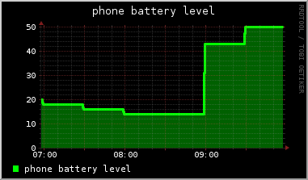

## Battery Grapher

Unfortunately trying to find something that simply graphs battery levels on my
laptop has proven to be quite a challenge. There were some older tools
available, but, being older tools, they relied on older technologies. Like APM
vs. the newer ACPI. So, I decided to wire up my own crappy battery grapher.

### ACPI command

It could rely on the sys class fs, but it doesn't. It relies on the acpi
command. The output of the acpi command is simple enough that I can parse it
easily and feed it into a little rrdtool database. Gets the job done with no
bells or whistles.

And so, here it is. The RRA's resolution could be better, and I'm always worried
about messing with that because it means I have to blow the current db away and
start a fresh one, with no data. Moving the data between RRD databases is
something I plan on learning how to do.

### /sys/class

Stared at /sys/class/power_supply a little longer and it became pretty obvious
that the value in /sys/class/power_supply/$BATX/capacity is the percentage of
capacity left, so I should retrofit this thing to use /sys/class rather than
acpi command. Another day maybe.

### graph example

Here's a sample of a graph and there are [samples of different resolutions here](graphs.md).

## Phone support

I've also been looking high and low for something that maintains historical
graphs of my phone that I can port around. Something where I can get at the
data. I bought a rad tool called AccuBattery of the play store and I highly
recommend it, but it feels too polished, not hackery enough for me (admittedly I
haven't dug through the logs).

Anyway, I used tasker to do a HTTP Post every 5 minutes to a dweet.io board that
I've wired into both freeboard.io and this script. So my graphs are getting
saved to freeboard (though the data doesn't stick beyond a single session) and
they're being saved to the same rrd file I'm using to monitor my laptop
batteries. Ultimately, that means this little RRD file is holding a bunch of
battery data, which is pretty cool. Should probably get this script and cronjob
running on an aws microserver, so it can be pulling the data all the time, not
just when my laptop is running.

Here's a sample graph.

And here's the gauge [in freeboard](https://freeboard.io/board/2IoJxK).

### TODO

* ~~add output of the calls made from here to push to dweet.io.~~

Honestly, I could replace rrd with dweet.io, but I don't want to. Part of this
was the joy of learning what I feel like has been a great technology lost to the
likes of graphite and grafana and cloudwatch. Whisper is cool, I get it.
Cloudwatch has been my penultimate graphing solution at work forever, because
it's beautifully implemented and simple and supports alerting out of the box.
But, sometimes, you just want to go back to the days of administering Quake
servers. Times were simpler. Once we kept track of frags, now we keep track of
queue counts.

This is done, also added some battery voltage data.